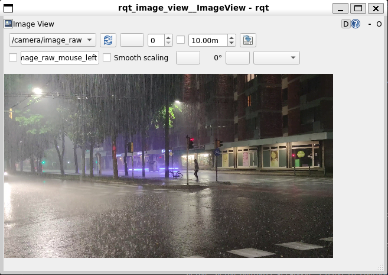

seg.py는 이미지와 json 파일을 사용하여 세그먼테이션이 적용된 사진을 반환받는 모듈

test_video_publisher_node는 영상을 ros노드로써 프레임단위로 30fps로 영상을 발행함

yolo_image_test는 이미지를 30프레임으로 영상으로 발행함

blur.py는 이미지에 가우시안 블러를 사용하여 이미지에 안개효과를 추가함

image_subscriber를 통해 이미지를 구독하여 영상으로 저장함
### 차도, 인도 구분
결국 이것도 cityscape도 학습시키고, 추가적인 학습이 진행된 것인데 그 데이터 셋도 한국이 아닌 해외이기에 큰 효과가 없었을 수 있었음

## WSL2 설치(윈도우 가상 서버)
1. Windows PowerShell을 관리자 모드
2. `wsl --install -d Ubuntu-22.04`로 우분투와 가상환경 설치후 재부팅
##### 현재 컴퓨터
```
<id : gnbupi>
<pw : rlatkddn@12>
```

3. sudo apt update && sudo apt upgrade -y
4. 로케일 설정
```bash
sudo apt install locales
sudo locale-gen en_US en_US.UTF-8
sudo update-locale LC_ALL=en_US.UTF-8 LANG=en_US.UTF-8
export LANG=en_US.UTF-8
```
5. ROS2 레포지토리 추가
```bash
# Universe 리포지토리 활성화
sudo apt install software-properties-common
sudo add-apt-repository universe

# ROS2 GPG 키 추가
sudo apt update && sudo apt install curl -y
sudo curl -sSL https://raw.githubusercontent.com/ros/rosdistro/master/ros.key -o /usr/share/keyrings/ros-archive-keyring.gpg

# ROS2 리포지토리 추가
echo "deb [arch=$(dpkg --print-architecture) signed-by=/usr/share/keyrings/ros-archive-keyring.gpg] http://packages.ros.org/ros2/ubuntu $(. /etc/os-release && echo $UBUNTU_CODENAME) main" | sudo tee /etc/apt/sources.list.d/ros2.list > /dev/null
```
6. ROS2 Humble 설치
```bash
# 패키지 목록 업데이트
sudo apt update

# ROS2 Desktop 설치 (GUI 도구 포함)
sudo apt install ros-humble-desktop
# 개발 도구 설치
sudo apt install ros-dev-tools
```
7. 환경 설정
```bash
# 매번 터미널 열 때마다 자동으로 ROS2 환경 로드
echo "source /opt/ros/humble/setup.bash" >> ~/.bashrc
source ~/.bashrc
```
8. 파이썬 도구
```bash
# Python pip 및 개발 도구
sudo apt install python3-pip python3-rosdep python3-colcon-common-extensions

# OpenCV 및 컴퓨터 비전 라이브러리
sudo apt install python3-opencv

# rosdep 초기화
sudo rosdep init
rosdep update
```
9. ROS2 추가 패키지
```bash
# cv_bridge (OpenCV-ROS2 연결)
sudo apt install ros-humble-cv-bridge

# 이미지 관련 패키지
sudo apt install ros-humble-image-transport ros-humble-image-common
```

##### 패키지 빌드
```bash
cd ~/ros2_ws

# 다시 빌드 (symlink 옵션으로 즉시 반영)
colcon build --packages-select road_safety_system --symlink-install

# 환경 설정
source install/setup.bash
```
##### 동영상 발행 노드
```bash
cd ~/ros2_ws
~/ros2_ws/install/road_safety_system/bin/test_video_publisher
```

##### RQT 이미지 뷰어로 확인
```bash
# rqt 이미지 관련 패키지 설치
sudo apt update
sudo apt install ros-humble-rqt-image-view

# 이미지 뷰어 실행
ros2 run rqt_image_view rqt_image_view
```


현재 /camera/image_raw라는 값으로 발행되고 있다는 것을 알 수 있고 30 프레임 단위로 이미지를 영상으로 볼 수 있음

  

##### AirNet
```bash
~/ros2_ws/install/road_safety_system/bin/airnet_node
```
/camera/image_restore로 발행됨

테스트 영상 출처
https://www.pexels.com/video/a-person-crossing-the-street-in-the-pouring-rain-4570394/

#### 깃허브 링크
https://github.com/VainF/DeepLabV3Plus-Pytorch
#### 환경 설정
##### 가상환경 생성
```bash
conda create -n ros2_segmentation python=3.10
conda activate ros2_segmentation
```
##### ROS2 설치

```bash
sudo apt update
sudo apt install software-properties-common
sudo add-apt-repository universe
sudo apt update && sudo apt install curl gnupg lsb-release
sudo curl -sSL https://raw.githubusercontent.com/ros/rosdistro/master/ros.key -o /usr/share/keyrings/ros-archive-keyring.gpg
echo "deb [arch=$(dpkg --print-architecture) signed-by=/usr/share/keyrings/ros-archive-keyring.gpg] http://packages.ros.org/ros2/ubuntu $(. /etc/os-release && echo $UBUNTU_CODENAME) main" | sudo tee /etc/apt/sources.list.d/ros2.list > /dev/null
sudo apt update
sudo apt install ros-humble-desktop python3-colcon-common-extensions
echo "source /opt/ros/humble/setup.bash" >> ~/.bashrc
source /opt/ros/humble/setup.bash
```

##### pytorch 설치
```bash
conda install pytorch torchvision torchaudio pytorch-cuda=11.8 -c pytorch -c nvidia
```
##### 그 외 필수 설치
```bash
pip install opencv-python pillow numpy matplotlib tqdm
pip install rclpy sensor_msgs cv_bridge
```
##### VainF 필수 설치
[https://github.com/VainF/DeepLabV3Plus-Pytorch/blob/master/requirements.txt]

혹은

```bash
pip install torch torchvision numpy pillow scikit-learn tqdm matplotlib visdom
```

##### 모델 다운로드
[https://www.dropbox.com/scl/fo/i4k86qqiuzy33aawug287/ABz2JiKdDqjwvDDzMHpeKZI?dl=0&e=1&preview=best_deeplabv3plus_mobilenet_cityscapes_os16.pth&rlkey=fgm7rgpeankeh9394j492sxif]
#### ROS 설정
##### 워크 스페이스 생성
```bash
cd ~/segmentation_ws
colcon build
source install/setup.bash
```


## 환경 세팅
### cuda 설치
```bash
nvidia-smi
```
gpu의 현재 상태를 확인하기 위해 사용함

이 명령어를 통해 AI server에 cuda가 아닌 nouveau가 깔려 있음을 확인함

```bash
sudo bash -c "echo 'blacklist nouveau' >> /etc/modprobe.d/blacklist-nvidia-nouveau.conf"

sudo bash -c "echo 'options nouveau modeset=0' >> /etc/modprobe.d/blacklist-nvidia-nouveau.conf"
```
nouveau 비활성화시키기 위한 명령어

```bash
sudo update-initramfs -u
```
initramfs 업데이트

```bash
sudo apt update
sudo ubuntu-drivers autoinstall
sudo reboot
```
NVIDIA 드라이버 설치


## 주작 사진
![[첨부파일/Pasted image 20250903174907.png]]